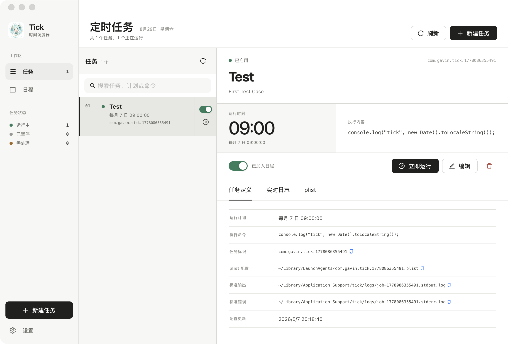

<div align="center">
  
  <h1>Tick</h1>
  <p>把系统定时任务变成看得懂、改得动的自动化，支持 macOS 和 Windows。</p>
  <p>
    <a href="https://github.com/yuxino/tick/releases/latest">下载最新版</a>
    · <a href="#开发">从源码运行</a>
    · <a href="https://github.com/yuxino/tick/issues">Issue</a>
  </p>
</div>



## 能做什么

- 创建、编辑、停用、立即运行和删除任务
- 按日历或固定间隔调度，并在月历中检查任务
- 直接编写 Node.js，或选择 `.js` 文件与 Node 可执行文件
- 保存前试跑脚本，查看 stdout、stderr 和任务定义
- 可选用 DeepSeek 从一句话生成可编辑草稿

macOS 使用当前用户 LaunchAgent，Windows 使用当前用户 Task Scheduler。Tick 只管理自己创建且带所有权标记的任务，不修改其他系统任务、不请求管理员权限。Windows 固定间隔支持 60 秒至 31 天，macOS 最短为 1 秒。

## 下载与运行

[最新版本](https://github.com/yuxino/tick/releases/latest) 提供 Apple 芯片 macOS DMG，以及 Windows x64 和 ARM64 当前用户 NSIS 安装包。Windows x64 已在 Windows 11 ARM64 的 x64 兼容环境完成[安装和核心交互验收](docs/validation/windows-11-arm64-x64-compat-2026-08-31.md)；Windows ARM64 已通过 CI 构建和架构校验，原生交互尚未验收。macOS 包未经 Apple 公证，Windows 包未做 Authenticode 签名，系统可能显示来源或发布者提示。

v0.1.4 是应用内更新的 bootstrap 版本：v0.1.3 及更旧版本仍需从 Releases 手动安装一次。之后可在“设置 → 应用更新”中主动检查、查看版本说明并安装经过签名验证的更新；Tick 不会后台下载或静默安装。

JavaScript 任务需要用户自行安装 Node.js。Tick 会检测可用版本，但不会安装 Node.js 或修改 PATH。调度环境不读取交互式 shell profile，Node、脚本和工作目录建议填写绝对路径。

## 数据与隐私

| 平台 | 任务 | 脚本、索引和日志 |
| --- | --- | --- |
| macOS | `~/Library/LaunchAgents/com.gavin.tick.*.plist` | `~/Library/Application Support/tick/` |
| Windows | 当前用户 Task Scheduler 中的 `Tick.job-*` | `%APPDATA%\tick\` |

DeepSeek 完全可选。不使用时，Tick 不需要 API Key；使用时，任务描述和 Key 会发送到 `api.deepseek.com`。Key 以明文保存在当前用户配置目录（macOS：`~/Library/Application Support/com.gavin.tick/settings.json`；Windows：`%APPDATA%\com.gavin.tick\settings.json`），可随时在设置中删除。Windows 依赖目录访问控制，并非加密存储。

## 开发

需要 Node.js 22 和 Rust。macOS 还需要 Xcode Command Line Tools；Windows 需要 Microsoft C++ Build Tools 和 WebView2。

```bash
npm install
npm run tauri dev
npm run check
npm run tauri build
```

CI 会在 Apple 芯片 macOS、Windows x64 和 Windows ARM64 上检查代码并构建安装包；Intel Mac 尚未验证。贡献说明见 [CONTRIBUTING.md](CONTRIBUTING.md)，安全问题请使用[私密漏洞报告](https://github.com/yuxino/tick/security/advisories/new)。

[MIT](LICENSE) © 2026 [yuxino](https://github.com/yuxino)
