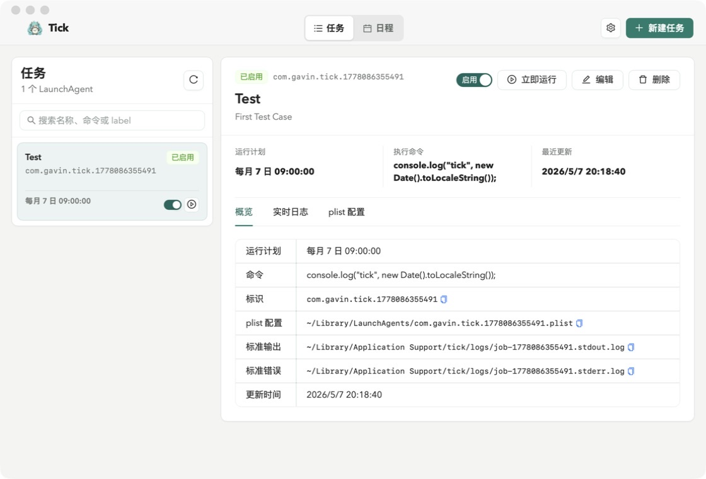
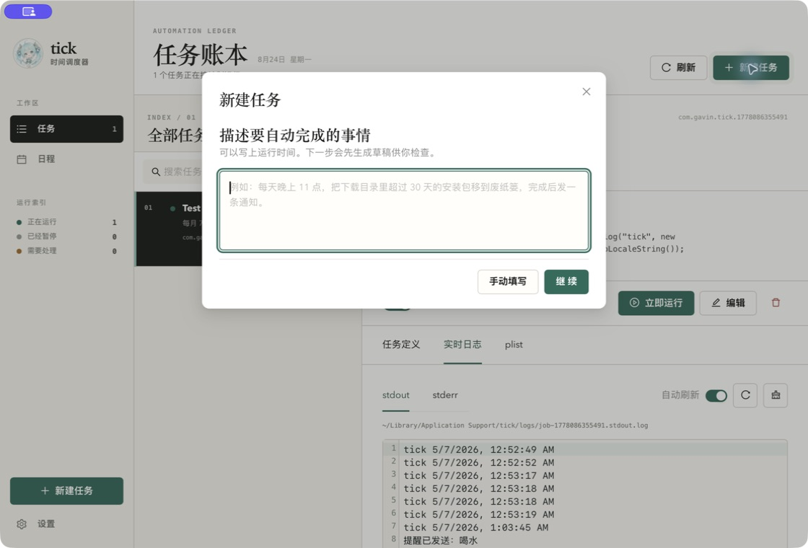
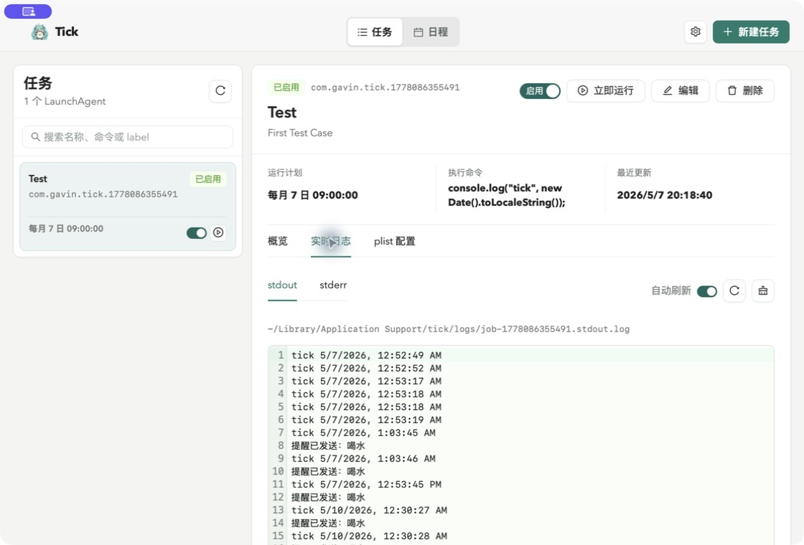

<div align="center">
  
  <h1>Tick</h1>
  <p>把 macOS LaunchAgent 变得看得见</p>
  <p>
    <a href="https://github.com/yuxino/tick/releases/latest"><strong>下载 Tick</strong></a>
    · <a href="#从源码运行">从源码运行</a>
    · <a href="https://github.com/yuxino/tick/issues">反馈问题</a>
  </p>
</div>

<br>



<br>

Tick 是一个为了理解 macOS **LaunchAgent** 而做的桌面实验。

与其反复手写 plist、记忆 `launchctl` 命令、去不同目录翻日志，我想把这些东西做成一个能看见、能修改、也能立即运行的小产品。Tick 不试图取代成熟的自动化工具；它更像一张通往 `launchd` 的可视化地图。

<table>
  <tr>
    <td width="50%"></td>
    <td width="50%"></td>
  </tr>
  <tr>
    <td align="center">创建任务，预览生成的 plist</td>
    <td align="center">运行任务，查看 stdout 和 stderr</td>
  </tr>
</table>

## Tick 能做什么

- 新建、编辑、删除、启用和停用由 Tick 管理的用户级 LaunchAgent
- 按固定日期与时间运行，或每隔 N 秒运行
- 执行内联 shell、脚本文件，以及通过 Node.js 等解释器运行命令
- 在保存前调试脚本，并查看 stdout / stderr 日志
- 预览 Tick 生成的 plist，理解界面操作对应的系统配置
- 用日程视图查看任务的预计运行时间
- 在应用内配置 DeepSeek，按自然语言生成 Node.js 任务脚本

## 它在系统里做了什么

Tick 只管理自己创建的用户级 LaunchAgent，不会修改系统级 daemon。

| 内容 | 位置 |
| --- | --- |
| LaunchAgent | `~/Library/LaunchAgents/com.gavin.tick.*.plist` |
| 日志与内联脚本 | `~/Library/Application Support/tick/` |
| DeepSeek API Key | macOS 钥匙串（服务名 `com.gavin.tick`） |
| 任务标识前缀 | `com.gavin.tick.` |

固定时间计划使用 `StartCalendarInterval`。由于 `launchd` 的日历计划不直接支持秒，Tick 会在需要时生成一个先 `sleep` 再执行命令的包装脚本；间隔计划使用原生 `StartInterval`。

> LaunchAgent 不会加载交互式 shell 的 profile。解释器、脚本和工作目录建议使用绝对路径，例如 `/opt/homebrew/bin/node`。

## 开始使用

1. 从 [Releases](https://github.com/yuxino/tick/releases/latest) 下载最新版
2. 新建一个任务，填写运行时间和脚本
3. 先点“立即运行”确认输出，再启用定时计划
4. 打开“plist 配置”和“实时日志”，看看 Tick 在背后做了什么

Tick 目前只面向 macOS，仍是一个学习性质的早期项目。使用前请确认任务脚本本身是安全的。

### 配置 DeepSeek

点击顶部的设置按钮，粘贴自己的 DeepSeek API Key 并保存。Tick 只会把密钥写入 macOS 钥匙串；不会保存到项目文件、浏览器存储、日志或环境变量，也不会在界面中读回完整密钥。删除配置时，密钥会从钥匙串一并移除。

## 从源码运行

需要 Node.js、Rust，以及 macOS 上可用的 Tauri 2 开发环境。

```bash
git clone https://github.com/yuxino/tick.git
cd tick
npm install
npm run tauri dev
```

验证前端与 Rust 后端：

```bash
npm run build
cd src-tauri
cargo test
```

构建可安装应用：

```bash
npm run tauri build
```

## 参与 Tick

欢迎提交 [Issue](https://github.com/yuxino/tick/issues) 和 Pull Request。参与开发前请阅读 [CONTRIBUTING.md](CONTRIBUTING.md)；安全问题请按 [SECURITY.md](SECURITY.md) 私下报告。

角色图标是为 Tick 生成的原创时钟精灵，不属于任何现有虚拟歌手或角色系列。

[MIT](LICENSE) © 2026 [yuxino](https://github.com/yuxino)
