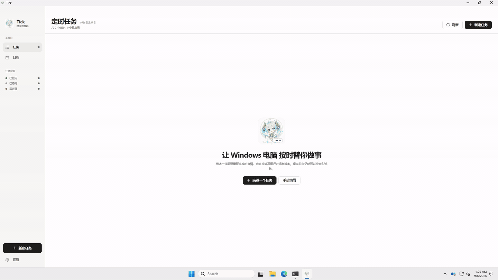

<div align="center">
  
  <h1>Tick</h1>
  <p>Make system-scheduled tasks easy to understand and edit on macOS and Windows.</p>
  <p>
    <a href="https://tick.yuxino.cn">Website</a>
    · <a href="https://github.com/yuxino/tick/releases/latest">Download the latest release</a>
    · <a href="#development">Run from source</a>
    · <a href="https://github.com/yuxino/tick/issues">Issues</a>
  </p>
  <p>English · <a href="README_ZH.md">简体中文</a></p>
</div>

<!-- project-demo-v1 -->
## Demo

<div align="center">
  <p><a href="docs/demos/demo.mp4"></a></p>
  <p>Set up a task, run it, then inspect the result and logs.</p>
  <p><a href="docs/demos/demo.mp4">Watch video</a></p>
</div>
<!-- /project-demo-v1 -->

## What you can do

- Create, edit, disable, run, and delete tasks.
- Schedule tasks by calendar or fixed interval, and inspect them in a monthly calendar.
- Write Node.js directly, or select a `.js` file and a Node executable.
- Test scripts before saving and inspect stdout, stderr, and the task definition.
- Optionally use DeepSeek to turn a description into an editable draft.

On macOS, Tick uses the current user's LaunchAgents; on Windows, it uses the current user's Task Scheduler. Tick only manages tasks it creates with its own ownership marker. It does not modify other system tasks or request administrator privileges. Fixed intervals range from 60 seconds to 31 days on Windows; the minimum on macOS is 1 second.

## Download and run

The [latest release](https://github.com/yuxino/tick/releases/latest) provides an Apple Silicon macOS DMG and per-user NSIS installers for Windows x64 and ARM64. The Windows x64 build has passed [installation and core interaction checks](docs/validation/windows-11-arm64-x64-compat-2026-08-31.md) in the x64 compatibility environment on Windows 11 ARM64. The Windows ARM64 build has passed CI and architecture checks; native interaction has not yet been validated. The macOS package is not notarized by Apple, and the Windows packages are not Authenticode-signed, so your system may show a source or publisher warning.

Version 0.1.4 is the bootstrap release for in-app updates: users on 0.1.3 or earlier need to install manually from Releases once. After that, open **Settings → Application Updates** to check for updates, read release notes, and install a signature-verified update. Tick does not download updates in the background or install them silently.

JavaScript tasks require a separately installed Node.js runtime. Tick detects available versions but does not install Node.js or modify PATH. Scheduled tasks do not load interactive shell profiles; use absolute paths for Node, scripts, and working directories.

## Data and privacy

| Platform | Tasks | Scripts, index, and logs |
| --- | --- | --- |
| macOS | `~/Library/LaunchAgents/com.gavin.tick.*.plist` | `~/Library/Application Support/tick/` |
| Windows | `Tick.job-*` in the current user's Task Scheduler | `%APPDATA%\tick\` |

DeepSeek is entirely optional. Tick needs no API key unless you use it. When enabled, the task description and API key are sent to `api.deepseek.com`. The key is stored in plaintext in the current user's configuration directory (`~/Library/Application Support/com.gavin.tick/settings.json` on macOS; `%APPDATA%\com.gavin.tick\settings.json` on Windows) and can be removed in Settings at any time. Windows relies on directory access controls; this is not encrypted storage.

## Development

Requires Node.js 22 and Rust, plus Xcode Command Line Tools on macOS or Microsoft C++ Build Tools and WebView2 on Windows.

```bash
npm install
npm run tauri dev
npm run check
npm run tauri build
```

CI checks the code and builds installers for Apple Silicon macOS, Windows x64, and Windows ARM64. Intel Macs have not been validated. See [CONTRIBUTING.md](CONTRIBUTING.md) for contribution guidance. Please use [private vulnerability reporting](https://github.com/yuxino/tick/security/advisories/new) for security issues.

[MIT](LICENSE) © 2026 [yuxino](https://github.com/yuxino)
